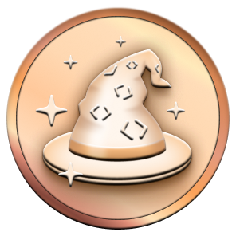
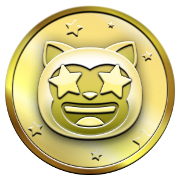
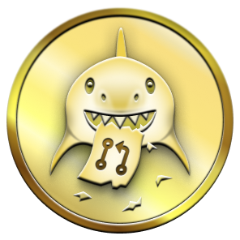

# 🏆 GitHub Achievements

A friendly, easy-to-browse guide to the GitHub badges (achievements) you can earn on your profile. This repo contains the documentation and the raw badge assets (PNG, SVG, GIF) inside `Media/`.

## Table of contents
- [Quick start & preview](#quick-start--preview)
- [What this repo contains](#what-this-repo-contains)
- [Highlights (at-a-glance)](#highlights-at-a-glance)
- [Achievement skin tones](#achievement-skin-tones)
- [Full achievement list (details)](#full-achievement-list-details)
- [Contributing](#contributing)
- [License](#license)

---

## Quick start & preview

- This `README.md` is written to render on GitHub. Image paths are relative so they also preview correctly in VS Code.
- To preview in a browser locally you can run a simple static server from the repo root (PowerShell example):

```powershell
# from repo root
python -m http.server 8000
# then open http://localhost:8000/README.md
```

Or open this file in VS Code and use "Open Preview".

---

## What this repo contains

- `README.md` — this file (user-friendly view and index)
- `Media/` — badge assets organized by name (PNG, SVG, GIF). Example: `Media/Badges/Pull-Shark/PNG/PullShark.png`

If you need a machine-readable inventory, tell me and I can add `badges.json` that enumerates each badge and its variants.

---

## Highlights (at-a-glance)

Here are a few common badges people look for. Click the badge for the full assets in the `Media/` folder.

- Pull Shark — merged pull requests

  

- Starstruck — popular repositories (stars)

  

- Quick Draw — quick issue/PR closure

  

---

## Achievement skin tones

Some badges use emoji skin-tone variants. These variants are included under `Media/Badges/*/PNG/Skin-Tones/`. The README displays the default skin tone; use the files in `Skin-Tones/` to preview other tones.

---

## Full achievement list (details)

<details>
<summary>Click to expand the full achievement table and descriptions</summary>

<!-- The detailed tables are preserved below. Paths are relative so the images preview in VS Code. -->

# 📃 Achievement List 📃

| Badge | Name | How to get | Needed amount | 
| :-: | :-: | :-: | :-: |
|  | Heart On Your Sleeve | (???) | <table>  <thead>  <tr>  <th>DEFAULT</th> <th>BRONZE</th>  <th>SILVER</th>  <th>GOLD</th>  </tr>  </thead>  <tbody>  <tr>  <td align="center"></td>   <td></td>  <td></td>  <td></td>  </tr>  <tr>  <td align="center">(?)</td>  <td align="center">(?)</td>  <td align="center">(?)</td>  <td align="center">(?)</td>  </tr>   </tbody>  </table> |
|  | Open Sourcerer | (???) | <table>  <thead>  <tr>  <th>DEFAULT</th> <th>BRONZE</th>  <th>SILVER</th>  <th>GOLD</th>  </tr>  </thead>  <tbody>  <tr>  <td align="center"></td>   <td></td>  <td></td>  <td></td>  </tr>  <tr>  <td align="center">(?)</td>  <td align="center">(?)</td>  <td align="center">(?)</td>  <td align="center">(?)</td>  </tr>   </tbody>  </table> |
|                  | Starstruck         | Created a repository that has many stars | <table>  <thead>  <tr>  <th>DEFAULT</th> <th>BRONZE</th>  <th>SILVER</th>  <th>GOLD</th>  </tr>  </thead>  <tbody>  <tr>  <td align="center"></td>   <td></td>  <td></td>  <td></td>  </tr>  <tr>  <td align="center">16</td>  <td align="center">128</td>  <td align="center">512</td>  <td align="center">4096</td>  </tr>   </tbody>  </table>      |
|                  | Quickdraw        | Gitty up!<br>(closed an issue / pull request within 5 minutes of opening) | <table>  <thead>  <tr>  <th>DEFAULT</th>  </tr>  </thead>  <tbody>  <tr>  <td></td> </tr>  <tr>  <td align="center">1</td> </tr>   </tbody>  </table> |
|      | Pair Extraordinaire  | [Coauthored](https://docs.github.com/pull-requests/committing-changes-to-your-project/creating-and-editing-commits/creating-a-commit-with-multiple-authors) commits on merged pull request | <table>  <thead>  <tr>  <th>DEFAULT</th> <th>BRONZE</th>  <th>SILVER</th>  <th>GOLD</th>  </tr>  </thead>  <tbody>  <tr>  <td align="center"></td>   <td></td>  <td></td>  <td></td>  </tr>  <tr>  <td align="center">1</td>  <td align="center">10</td>  <td align="center">24</td>  <td align="center">48</td>  </tr>   </tbody>  </table>      |
|      | Pull Shark  | Opened a pull request that has been merged | <table>  <thead>  <tr>  <th>DEFAULT</th> <th>BRONZE</th>  <th>SILVER</th>  <th>GOLD</th>  </tr>  </thead>  <tbody>  <tr>  <td align="center"></td>   <td></td>  <td></td>  <td></td>  </tr>  <tr>  <td align="center">2</td>  <td align="center">16</td>  <td align="center">128</td>  <td align="center">1024</td>  </tr>   </tbody>  </table>      |
|  | Galaxy Brain | Answered a discussion<br>(got an accepted answer) | <table>  <thead>  <tr>  <th>DEFAULT</th> <th>BRONZE</th>  <th>SILVER</th>  <th>GOLD</th>  </tr>  </thead>  <tbody>  <tr>  <td></td>  <td></td>  <td></td>  <td></td>  </tr>  <tr>  <td align="center">2</td> <td align="center">8</td>  <td align="center">16</td>  <td align="center">32</td>  </tr>   </tbody>  </table>
|                  | YOLO        | Merged a pull request without a review | <table>  <thead>  <tr>  <th>DEFAULT</th>  </tr>  </thead>  <tbody>  <tr>  <td></td> </tr>  <tr>  <td align="center">1</td> </tr>   </tbody>  </table> |
|                  | Public Sponsor        | Sponsored an open source contributor through [GitHub Sponsors](https://github.com/sponsors) | <table>  <thead>  <tr>  <th>DEFAULT</th>  </tr>  </thead>  <tbody>  <tr>  <td></td> </tr>  <tr>  <td align="center">1</td> </tr>   </tbody>  </table> |


</details>

---

## Contributing

If you'd like improvements, examples, or a machine-readable manifest, open an issue or send a PR. Small ideas:

- Add `badges.json` to list badges programmatically
- Create a GitHub Pages site (`index.html`) to browse badges visually
- Provide a small script to generate badge snippet markdown for other repos

---

## License

This repository includes a `LICENSE` file — see it for the license terms.
