<picture>
  <source srcset="https://fonts.gstatic.com/s/e/notoemoji/latest/1f3c6/512.webp" type="image/webp">
  
  ＧｉｔＨｕｂ Ａｃｈｉｅｖｅｍｅｎｔｓ
</picture>

### _Unlock and showcase your development journey_

<picture>
  <source media="(prefers-color-scheme: dark)" srcset="https://repository-images.githubusercontent.com/634841108/401fc2d0-ee6e-4a75-aabf-e63330221642">
  
</picture>

---

<picture>
  <source srcset="https://fonts.gstatic.com/s/e/notoemoji/latest/1f680/512.webp" type="image/webp">
  
   Ｑｕｉｃｋ Ｓｔａｒｔ
</picture>

> **Profile Customization**: Achievements are **optional** and visible by default on your public profile. You can manage their visibility in your [profile settings](https://github.com/settings).

```mermaid
graph LR
    A[🔓 Unlock Achievement] --> B[🏅 Appears on Profile]
    B --> C[⚙️ Manage in Settings]
    C --> D[👁️ Public/Private Toggle]
```

---

<picture>
  <source srcset="https://fonts.gstatic.com/s/e/notoemoji/latest/1f947/512.webp" type="image/webp">
  
  Ａｃｈｉｅｖｅｍｅｎｔ Ｃａｔｅｇｏｒｉｅｓ
</picture>

### 🌟 **Core Achievements**

| Achievement | Description | Tiers | Requirements |
|:---:|:---:|:---:|:---:|
|  | **Starstruck** _Repository popularity_ | 4 Tiers | 16 → 128 → 512 → 4,096 stars |
|  | **Pull Shark** _Merge contributions_ | 4 Tiers | 2 → 16 → 128 → 1,024 merged PRs |
|  | **Galaxy Brain** _Community helper_ | 4 Tiers | 2 → 8 → 16 → 32 accepted answers |
|  | **Pair Extraordinaire** _Collaboration master_ | 4 Tiers | 1 → 10 → 24 → 48 co-authored commits |

<picture>
  <source srcset="https://fonts.gstatic.com/s/e/notoemoji/latest/26a1/512.webp" type="image/webp">
  
  Ｓｐｅｃｉａｌ Ａｃｈｉｅｖｅｍｅｎｔｓ
</picture>

| Achievement | Description | Type | How to Unlock |
|:---:|:---:|:---:|:---:|
|  | **Quickdraw** _Lightning fast_ | Single | Close issue/PR within 5 minutes |
|  | **YOLO** _Living dangerously_ | Single | Merge PR without review |
|  | **Public Sponsor** _Supporting OSS_ | Single | Sponsor via GitHub Sponsors |

<picture>
  <source srcset="https://fonts.gstatic.com/s/e/notoemoji/latest/1f52e/512.webp" type="image/webp">
  
  Ｍｙｓｔｅｒｙ Ａｃｈｉｅｖｅｍｅｎｔｓ
</picture>

| Achievement | Description | Tiers | Status |
|:---:|:---:|:---:|:---:|
|  | **Heart On Your Sleeve** _Emotional contributor_ | 4 Tiers | 🔒 Requirements unknown |
|  | **Open Sourcerer** _Magic contributor_ | 4 Tiers | 🔒 Requirements unknown |

---

## 🎨 **Tier Visualizations**

**Starstruck Tiers:**
| Default | Bronze | Silver | Gold |
|:---:|:---:|:---:|:---:|
|  |  |  |  |
| 16 stars | 128 stars | 512 stars | 4,096 stars |

**Pull Shark Tiers:**
| Default | Bronze | Silver | Gold |
|:---:|:---:|:---:|:---:|
|  |  |  |  |
| 2 merged PRs | 16 merged PRs | 128 merged PRs | 1,024 merged PRs |

**Galaxy Brain Tiers:**
| Default | Bronze | Silver | Gold |
|:---:|:---:|:---:|:---:|
|  |  |  |  |
| 2 answers | 8 answers | 16 answers | 32 answers |

**Pair Extraordinaire Tiers:**
| Default | Bronze | Silver | Gold |
|:---:|:---:|:---:|:---:|
|  |  |  |  |
| 1 co-authored commit | 10 co-authored commits | 24 co-authored commits | 48 co-authored commits |

**Heart On Your Sleeve Tiers:**
| Default | Bronze | Silver | Gold |
|:---:|:---:|:---:|:---:|
|  |  |  |  |
| ??? | ??? | ??? | ??? |

**Open Sourcerer Tiers:**
| Default | Bronze | Silver | Gold |
|:---:|:---:|:---:|:---:|
|  |  |  |  |
| ??? | ??? | ??? | ??? |

---

## 🎨 Customization Features

### 🖐️ **Skin Tone Variations**

Some achievements adapt to your [emoji skin tone preference](https://github.com/settings/appearance):

**Starstruck Variations:**
| Default | Light | Medium-Light | Medium | Medium-Dark | Dark |
|:---:|:---:|:---:|:---:|:---:|:---:|
| 👋 | 👋🏻 | 👋🏼 | 👋🏽 | 👋🏾 | 👋🏿 |
|  |  |  |  |  |  |

**Quickdraw Variations:**
| Default | Light | Medium-Light | Medium | Medium-Dark | Dark |
|:---:|:---:|:---:|:---:|:---:|:---:|
| 👋 | 👋🏻 | 👋🏼 | 👋🏽 | 👋🏾 | 👋🏿 |
|  |  |  |  |  |  |

---

## 💎 **Highlights & Special Badges**

| Badge | Name | How to Earn |
|:---:|:---:|:---|
|  | **GitHub Pro** | Subscribe to [GitHub Pro](https://docs.github.com/en/get-started/learning-about-github/githubs-products#github-pro) |
|  | **Developer Program** | Join the [GitHub Developer Program](https://docs.github.com/en/developers/overview/github-developer-program) |
|  | **Security Hunter** | Find vulnerabilities via [GitHub Security](https://bounty.github.com/) |
|  | **Campus Expert** | Join the [GitHub Campus Program](https://education.github.com/experts) |
|  | **Advisory Credit** | Contribute to [GitHub Advisory Database](https://github.com/advisories) |

---

## 🏛️ **Legacy Collection**

> **These achievements are no longer available but remain on profiles that earned them**

| Achievement | Legacy Status | Historical Context |
|:---:|:---:|:---|
|  | **Mars 2020 Contributor** | 🚠[Ingenuity Helicopter Mission](https://github.com/readme/featured/nasa-ingenuity-helicopter) |
|  | **Arctic Code Vault** | 🧊 [2020 Archive Program](https://archiveprogram.github.com/) |

---

## 📚 Resources & Links

---

### 🎮 **Start Your Achievement Journey**

**Ready to unlock your first achievement?**  
_Start contributing, collaborating, and building amazing things!_

---

Made with ❤️ by the GitHub community • [Contribute to this project](https://github.com/github/achievements)

